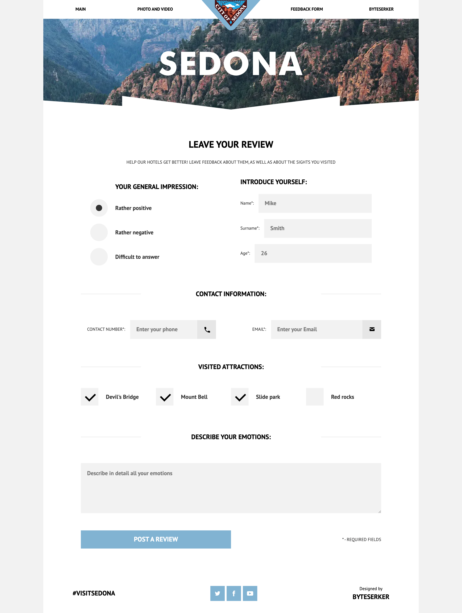

# Sedona

<div align="center">


</div>

## Overview

Responsive static website for the “Sedona” travel theme. Built with a lightweight Gulp pipeline that compiles Sass, bundles/transpiles JS, optimizes images (including WebP), and outputs production files to `docs/` for GitHub Pages hosting.

## Key Features

- Separate mobile/tablet/desktop styles with minified CSS bundles
- JS transpilation and bundling (Babel + Webpack) with minified output
- Image optimization and WebP generation for smaller payloads

## Tech Stack

HTML5, Sass, Gulp 4, Babel 7, Webpack 4, PostCSS (autoprefixer, cssnano), Node.js 18

## Architecture

Gulp tasks handle Sass → CSS, Babel + Webpack for JS, HTML minification, and image optimization (JPEG/PNG/WebP). Source files live in `src/`; production artifacts are written to `docs/` (suitable for GitHub Pages).

## Performance & Accessibility

Minified CSS/JS, compressed images with WebP outputs, and straightforward semantic HTML for accessible, responsive layouts.

## Prerequisites

- Node.js: `18.17.0`

## Installation

```bash
git clone https://github.com/maxgalchenko/Sedona.git
cd Sedona
npm install
```

## Quick Start

```bash
npx gulp dev
# Production
npx gulp build
# Open ./docs/index.html
```

Open http://localhost:3000

## Available Scripts

- `npm run test` – placeholder test script (prints a message and exits)
- `npx gulp dev` – start local dev server with live reload (BrowserSync)
- `npx gulp build` – build optimized assets into `docs/`

## Screenshots





---

<div align="center">

Built with ❤️ by [Maksym Galchenko](https://github.com/maxgalchenko)

[](https://www.linkedin.com/in/galchenko-max/)
[](https://portfolio-green-six-29.vercel.app/)
[](mailto:galchenko.maksym@gmail.com)


</div>
